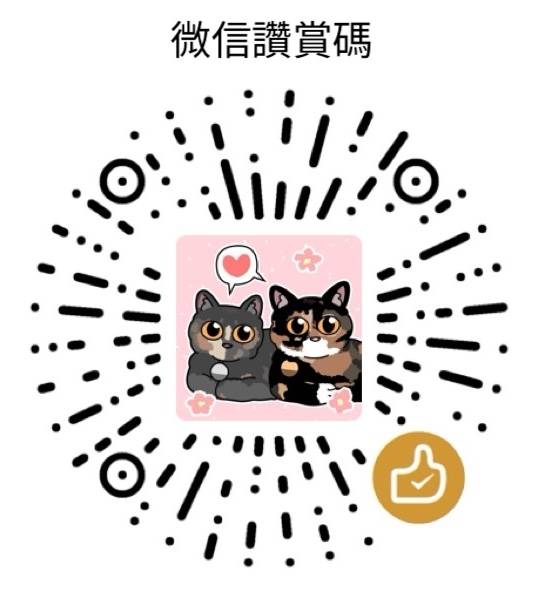

鴻蒙 HarmonyOS 粵拼輸入法
======

採用 [香港語言學學會粵語拼音方案](https://jyutping.org/jyutping)  
候選詞會標注對應嘅粵拼

另有 Android、iOS、iPadOS 及 macOS 版: https://jyutping.app

QQ 交流群: `293148593`  
Telegram 交流群: `@jyutping`

## 擷屏（Screenshots）

## 下載安裝（Download）

 

## 支持作者開發（Support this project）
官網: https://jyutping.app/donate

Patreon: https://patreon.com/bingzheung

愛發電: https://afdian.com/a/jyutping

Ko-fi: https://ko-fi.com/zheung

PayPal: https://paypal.me/bingzheung

Bitcoin: `bc1qx5tjmlvq8ydmfzxt5fru7vqq0khjkhf2savheh`

